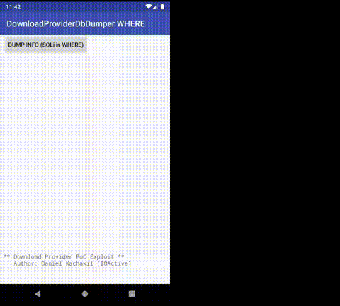

# AOSP-DownloadProviderDbDumperSQLiWhere
PoC Exploiting SQL Injection in Android's Download Provider in Selection Parameter (CVE-2019-2198)

## Security Advisory
[Android (AOSP) Download Provider SQL Injection in Query Selection Parameter (CVE-2019-2198)](https://act-on.ioactive.com/acton/attachment/34793/f-0b1db136-6474-4c86-b944-0ba96a89283a/1/-/-/-/-/cve-2019-2198.pdf)

## Demo

